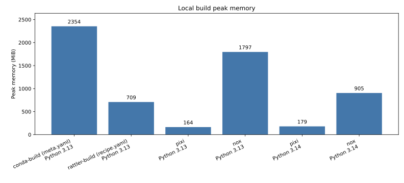
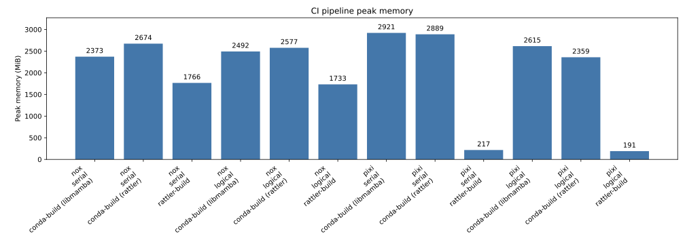
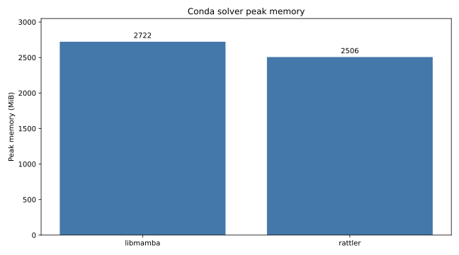

################################################################
Comparison of Peak Memory Usage Among Conda-Compatible Tools
################################################################

.. abstract::

   An experiment comparing the peak memory usage of Conda-compatible tools during local and continuous-integration builds.

Introduction
============

This technote describes an experiment comparing the peak memory usage of Conda-compatible tools.

Our current setup runs Conda builds every weekday.
When we need to test two Python versions, we must build twice.
This increases build time and may increase memory pressure on the Jenkins nodes.

This experiment has two goals:

a) verify whether conda-build produces a high memory load; and
b) compare alternative tools to determine whether they reduce memory usage.

The measurements cover local tool runs, CI pipeline runs, and solver-specific conda-build runs.
Each local test records elapsed time and maximum resident set size for three samples.
The CI measurements compare different test runners, execution modes, and package builders.
The solver comparison records elapsed time and maximum resident set size for libmamba and experimental Rattler configurations.

Results
=======

Local builds
------------

The first table compares local build memory usage across conda-build, Nox, Pixi, and rattler-build.
The plot shows the median peak memory across three samples for each tool and Python version.
In these tests, conda-build and Nox use more memory than Pixi and rattler-build.
Pixi and rattler-build also complete the tests in less time.

CI pipeline runs
-----------------

The second table shows peak memory usage during CI pipeline runs.
The plot compares each test runner, execution mode, and package builder combination.
The package builder has a large effect on peak memory in these measurements.

Solver comparison
-----------------

The third table compares peak memory usage for the libmamba and experimental Rattler solvers.
The plot shows the median peak memory across three samples for each solver.

Conclusion
==========

In these tests, Pixi and rattler-build use less memory and complete the local tests in less time than the Conda-based alternatives.
The CI measurements also show substantially lower peak memory when rattler-build is used instead of conda-build.
The solver comparison shows similar peak memory usage for libmamba and experimental Rattler.
These results suggest that replacing conda-build with rattler-build could reduce memory pressure on Jenkins CI.
